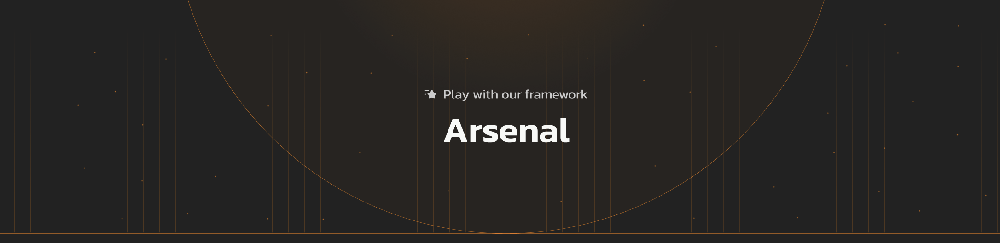

---
hide:
  - toc
---

<div class="hero">
    
</div>

# Welcome to Arsenal

Arsenal is [Clustr's](https://clustr.network) lightweight, unified AI agent framework, designed to help you build intelligent applications effortlessly. With its powerful, unified interface, you can seamlessly interact with multiple AI models, execute complex skills.

<div class="grid" markdown>

<div class="card" markdown>

### 🚀 Easy start

Quickly build AI agents with minimal code

</div>

<div class="card" markdown>

### 🔧 Customize

Add custom skills to extend functionality

</div>

<div class="card" markdown>

### ⚡ Scale

Efficient async design

</div>

<div class="card" markdown>

### 🌐 Connect

Access 300+ LLMs through one unified API

</div>

</div>


## What Makes Arsenal Different?

- **Lightweight Core**: Only 12KB - no bloated dependencies
- **Provider Agnostic**: Work with OpenAI, Anthropic, X-AI, OpenRouter, and more
- **Modern Design**: Built with Python 3.12+, Pydantic, and async-first architecture
- **Developer-Focused**: Clear documentation, type hints, and intuitive API

## Quick Example

```python
import os
from dotenv import load_dotenv
from arsenalpy.agents import Agent, AgentConfig
import asyncio

load_dotenv()

# Initialize an agent
agent = Agent(
    name="my_assistant",
    provider="openai",  # Also supports: anthropic, openrouter, and more
    system_prompt="You are a helpful AI assistant.",
    model="o3-mini",
    api_key=os.getenv("OPENAI_API_KEY"),
    config=AgentConfig(
        temperature=0.7,
        max_completion_tokens=1000,
    ),
)

# Use the agent
async def main():
    # Simple completion
    response = await agent.do("What are three creative uses for AI in Blockchain?")
    print(response)

    print("\n--- Streaming Response ---\n")

    # Streaming response
    async for chunk in agent.do_stream("Explain EVM in simple terms."):
        print(chunk, end="", flush=True)

if __name__ == "__main__":
    asyncio.run(main())
```


## Get Ideas on How to Use Arsenal


<div class="video-gallery">

  <div class="video-item">
    <h3>Grab youtube transcripts , find contracts and execute trades</h3>
    <video controls preload="metadata">
      <source src="assets/vdo_compressed/ytdemo.mp4" type="video/mp4">
      Your browser does not support the video tag.
    </video>
  </div>
  <div class="video-item">
    <h3>Grok/Openai style deep Research with Arsenal </h3>

    <video controls preload="metadata">
      <source src="assets/vdo_compressed/deepresearch.mp4" type="video/mp4">
      Your browser does not support the video tag.
    </video>
  </div>

  <div class="video-item">
    <h3>Let ai help you with your protocol research</h3>
    <video controls preload="metadata">
      <source src="assets/vdo_compressed/docsaresenal.mp4" type="video/mp4">
      Your browser does not support the video tag.
    </video>
  </div>

  <div class="video-item">
    <h3>Go long or short via natural language on hyperliquid </h3>
    <video controls preload="metadata">
      <source src="assets/vdo_compressed/hyperarsenal.mp4" type="video/mp4">
      Your browser does not support the video tag.
    </video>
  </div>


</div>


## Ready to Get Started?

<div class="grid" markdown>

<div class="card" markdown>

### 🕒 [Quick Start Guide](getting-started/quickstart.md)

Get up and running in minutes with our step-by-step guide.

</div>

<div class="card" markdown>

### 📖 [Core Concepts](core-concepts/agents.md)

Learn the fundamental concepts behind Arsenal's design.

</div>

<div class="card" markdown>

### 🛠️ [Skills & Tools](core-concepts/skills.md)

Extend your agents with powerful custom capabilities.

</div>

<div class="card" markdown>

### 📋 [API Reference](api/agents.md)

Detailed API documentation for developers.

</div>

</div>

## Community & Support

<div class="community-links" markdown>

<div class="community-card" markdown>
<span class="community-icon github"></span>

### [GitHub](https://github.com/clustrlabs/arsenalpy)
Star us and contribute to the project
</div>

<div class="community-card" markdown>
<span class="community-icon x-twitter"></span>

### [X](https://x.com/Clustr_Labs)
Follow for updates and announcements
</div>

<div class="community-card" markdown>
<span class="community-icon discord"></span>

### [Discord](https://discord.gg/clustr)
Join our community chat
</div>

<div class="community-card" markdown>
<span class="community-icon issues"></span>

### [Issues](https://github.com/clustrlabs/arsenalpy/issues)
Report bugs or request features
</div>

</div>
